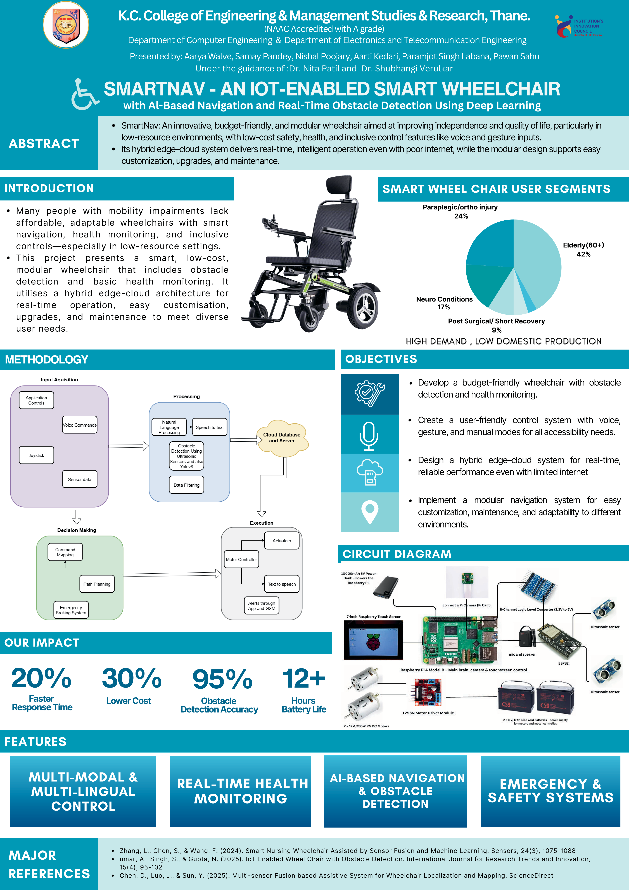

# ♿ SmartNav - An IoT-Enabled AI Smart Wheelchair

  

> ⚠️ **Note:** This project is currently under active development.  
> Detailed documentation, hardware schematics, and source code will be released as the project approaches completion.  
> Thank you for your interest and support!

---

## 🎯 About The Project

The **AI-Powered Smart Wheelchair** is an innovative assistive technology designed to **redefine mobility and care** for individuals with physical impairments.  

Unlike traditional wheelchairs, this project transforms the device into an **intelligent companion** that emphasizes **safety, health monitoring, and independence**.

Our vision is to create a wheelchair that does more than move — it **cares, protects, and empowers**.

---

## 🚀 Vision & Objectives

We aim to design a **cost-effective, multifunctional smart wheelchair** that reduces dependency on caregivers while creating a **safer and more connected experience**.

### ✅ Key Objectives
- **Enhance Safety** → Intelligent automated collision-avoidance system.  
- **Promote Independence** → Hands-free AI-powered voice navigation.  
- **Enable Proactive Health Management** → Real-time vitals monitoring + emergency alerts.  
- **Reduce Medication Errors** → Automated pill dispenser with reminders.  
- **Improve Sustainability** → Hybrid energy (solar + kinetic) for extended range.  

---

## ✨ Core Features (In Development)

| Feature | Description |
|---------|-------------|
| 🎤 **Multilingual Speech-to-Text** | Converts spoken commands from users into text in multiple languages to ensure accessibility. |
| 🎙️ **Voice Command Recognition** | Detects and identifies voice commands to control wheelchair navigation hands-free. |
| 🛑 **Collision Avoidance** | Uses ultrasonic sensors to detect obstacles and automatically stop or reroute to prevent accidents. |
| ❤️ **Health Monitoring** |Continuously tracks **pulse rate and body temperature**, showing real-time health data on an onboard screen. |
| 📧 **Emergency SMS Alerts** | Sends real-time health data and location alerts to caregivers or family during abnormal readings or emergencies. |
| ☀️ **Dual Energy System** | Combines a solar panel (which also serves as a sunshade) with a hub dynamo to sustainably charge the battery. |
| 🕹️ **Multimodal controls** | Offers alternative input modes—such as voice, application input, or joystick for users who cannot rely solely on voice. |

---

## 🛠️ Technology Stack (Planned)

- **Primary Controller** → Raspberry Pi (AI, voice, decision-making)  
- **Real-time Controller** → ESP32 (sensors, motors, real-time tasks)  
- **Software** → Python (high-level control), C++/Arduino (low-level management)  
- **Sensors** → Ultrasonic, MAX30102 (pulse), DS18B20 (temperature)  
- **Communication** → SIM800L GSM module (SMS alerts)  

---

## 📈 Project Status

🔧 Currently in **hardware integration & software development phase**.  
Our immediate milestones:  
- Finalize control algorithms  
- Begin rigorous system testing  

Stay tuned for updates — this repo will soon include **detailed documentation, hardware schematics, and full source code**.  

---
## 📽️ Demo Video

---
## 🤝 Contribution & Community

We welcome contributions, feedback, and ideas!  
If you’d like to collaborate or suggest improvements, feel free to:  
- Open an **issue**  
- Submit a **pull request**  
- Reach out to us for discussions  

---

## 📬 Contact

👤 **Team SmartNav**  
📧 *samaypandey2022@kccemsr.edu.in*  

---

⭐ If you believe in our vision, **star this repository** to support us!
