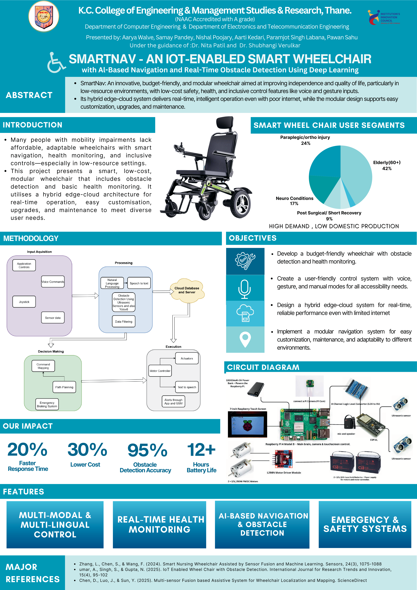

# ♿ SmartNav - An IoT-Enabled AI Smart Wheelchair

<p align="center">
  
</p>

> ⚠️ **Note:** This project is currently under active development.  
> Detailed documentation, hardware schematics, and source code will be released as the project approaches completion.  
> Thank you for your interest and support!

---

## 🎯 About The Project

The **AI-Powered Smart Wheelchair** is an innovative assistive technology designed to **redefine mobility and care** for individuals with physical impairments.  

Unlike traditional wheelchairs, this project transforms the device into an **intelligent companion** that emphasizes **safety, health monitoring, and independence**.

Our vision is to create a wheelchair that does more than move — it **cares, protects, and empowers**.

---

## 🚀 Vision & Objectives

We aim to design a **cost-effective, multifunctional smart wheelchair** that reduces dependency on caregivers while creating a **safer and more connected experience**.

### ✅ Key Objectives
- **Enhance Safety** → Intelligent automated collision-avoidance system.  
- **Promote Independence** → Hands-free AI-powered voice navigation.  
- **Enable Proactive Health Management** → Real-time vitals monitoring + emergency alerts.  
- **Reduce Medication Errors** → Automated pill dispenser with reminders.  
- **Improve Sustainability** → Hybrid energy (solar + kinetic) for extended range.  

---

## Overview
This project implements a voice-controlled wheelchair system with two operational modes:
1. **Online LLM Mode**: Authenticated users can ask questions to an online language model
2. **Command Mode**: Authenticated users can control the wheelchair using voice commands

## ✨ Core Features (In Development)

| Feature | Description |
|---------|-------------|
| 🎤 **Multilingual Speech-to-Text** | Converts spoken commands from users into text in multiple languages to ensure accessibility. |
| 🎙️ **Voice Command Recognition** | Detects and identifies voice commands to control wheelchair navigation hands-free. |
| 🛑 **Collision Avoidance** | Uses ultrasonic sensors to detect obstacles and automatically stop or reroute to prevent accidents. |
| ❤️ **Health Monitoring** | Continuously tracks **pulse rate and body temperature**, showing real-time health data on an onboard screen. |
| 📧 **Emergency SMS Alerts** | Sends real-time health data and location alerts to caregivers or family during abnormal readings or emergencies. |
| ☀️ **Dual Energy System** | Combines a solar panel (which also serves as a sunshade) with a hub dynamo to sustainably charge the battery. |
| 🕹️ **Multimodal controls** | Offers alternative input modes—such as voice, application input, or joystick for users who cannot rely solely on voice. |

---

## 🛠️ Technology Stack (Planned)

- **Primary Controller** → Raspberry Pi (AI, voice, decision-making)  
- **Real-time Controller** → ESP32 (sensors, motors, real-time tasks)  
- **Software** → Python (high-level control), C++/Arduino (low-level management)  
- **Sensors** → Ultrasonic, MAX30102 (pulse), DS18B20 (temperature)  
- **Communication** → SIM800L GSM module (SMS alerts)  

---

## 📈 Project Status

🔧 Currently in **hardware integration & software development phase**.  
Our immediate milestones:  
- Finalize control algorithms  
- Begin rigorous system testing  

Stay tuned for updates — this repo will soon include **detailed documentation, hardware schematics, and full source code**.  

---

## ⚙️ Technical Implementation Details

### Key System Features
- **Voice Authentication**: Secure access through voice profile matching
- **Comprehensive Multilingual Command Support**: Recognizes commands in all languages supported by Whisper models:
  - English
  - Hindi
  - Marathi
  - Spanish
  - French
  - German
  - Italian
  - Chinese
  - Japanese
  - Russian
  - And many more languages
- **Enhanced Command Recognition**: Uses advanced fuzzy matching and phonetic algorithms
- **Automatic Language Detection**: Automatically identifies the spoken language
- **Text-to-Speech Feedback**: Provides auditory feedback for commands in the detected language
- **Optimized for Raspberry Pi 4B**: Efficient resource usage for embedded platform

### 🗣️ Multilingual Command System
The system can recognize commands in multiple languages and handle phonetic variations using the Whisper tiny model:

#### Supported Commands in Multiple Languages
- **Forward**: 
  - English: "forward", "go ahead", "straight" 
  - Hindi: "aage badho", "आगे बढ़ो"
  - Marathi: "pudhe ja", "पुढे जा"
  - Spanish: "adelante", "sigue adelante"
  - French: "avancer", "en avant"
  - German: "vorwärts", "geradeaus" 
  - Italian: "avanti", "vai avanti"
  - Chinese: "前进", "向前"
  - Japanese: "前進", "前へ"
  - Russian: "вперед", "прямо"

- **Backward**: 
  - English: "backward", "go back", "reverse"
  - Hindi: "peeche jao", "पीछे जाओ"
  - Marathi: "mage ja", "मागे जा"
  - Spanish: "atrás", "hacia atrás"
  - French: "reculer", "en arrière"
  - German: "rückwärts", "zurück"
  - Italian: "indietro", "vai indietro"
  - Chinese: "后退", "向后"
  - Japanese: "後退", "バック"
  - Russian: "назад", "задний ход"
  
- **Left**/**Right**: Similar multilingual support for all directions
- **Start**/**Stop**: Full multilingual command recognition

#### Phonetic Recognition
The system handles common speech-to-text errors in transcription:
- "bye mude" → recognized as "baaye mudo" (turn left in Hindi)
- "die mude" → recognized as "daaye mudo" (turn right in Hindi)

### 🧠 AI Models Used

The SmartNav wheelchair control system leverages several key AI models to achieve robust performance:

1. **Speech Recognition**: OpenAI's Whisper Tiny Model
   - Optimized for low-latency command recognition on Raspberry Pi
   - Supports 30+ languages with on-device processing
   - Quantized to 8-bit for efficient CPU execution

2. **Voice Authentication**: Custom Voice Encoder
   - Uses Resemblyzer for speaker verification
   - Creates voice embeddings for secure user authentication
   - Low false-positive rate with optimized thresholds

3. **Language Understanding**: Fuzzy Matching & Phonetic Algorithms
   - Handles variations in pronunciation and speech patterns
   - Adapts to accents and speech impediments
   - Custom pattern matching for improved command accuracy

4. **Text-to-Speech**: Piper TTS
   - Offline, lightweight TTS engine
   - Multi-voice support (male/female) across languages
   - ONNX runtime optimized for Raspberry Pi

5. **Conversational AI**: Llama 3.2-3B-Instruct (optional)
   - Low-resource LLM for conversational support
   - Can run locally or access cloud API when connectivity available
   - Provides contextual responses to user questions

### 🔄 System Architecture

The wheelchair control system is built on a modular architecture:

```
┌─────────────────────────────────────────────────────────┐
│                   Voice Input Pipeline                  │
└───────────────┬───────────────────────────┬─────────────┘
                │                           │
┌───────────────▼───────┐       ┌───────────▼───────────┐
│  Voice Authentication │       │ Command Recognition   │
│  - Speaker verification│       │ - Speech-to-text      │
│  - Profile matching    │       │ - Language detection  │
└───────────────┬───────┘       └───────────┬───────────┘
                │                           │
                │           ┌───────────────▼───────────┐
                │           │ Command Processing        │
                │           │ - Intent classification   │
                │           │ - Fuzzy matching         │
                │           └───────────────┬───────────┘
                │                           │
┌───────────────▼───────┐       ┌───────────▼───────────┐
│  LLM Query Mode        │       │ Motion Control        │
│  - Question answering  │       │ - Direction commands  │
│  - Information access  │       │ - Speed control       │
└───────────────┬───────┘       └───────────┬───────────┘
                │                           │
┌───────────────▼───────────────────────────▼───────────┐
│                     Response System                   │
│              (Text-to-Speech Feedback)                │
└─────────────────────────────────────────────────────────┘
```

### 🔊 Voice Authentication System

The voice authentication system uses a combination of:
- **Voice embedding generation** - Creates a unique 256-dimensional voice signature
- **Similarity scoring** - Compares live voice to stored profiles
- **Adaptive thresholding** - Adjusts recognition strictness based on environment

### 📡 Command Recognition Pipeline

1. **Audio Capture**: High-quality audio recording with noise reduction
2. **Preprocessing**: Normalization and filtering for better recognition
3. **Transcription**: Speech-to-text via Whisper tiny model
4. **Language Detection**: Automatic identification of spoken language
5. **Command Matching**: Fuzzy matching to predefined command set
6. **Feedback**: Language-specific audio response

---

## 📽️ Demo Video

[Demo video coming soon]

---

## 💡 Current Development Focus

Our current development focus is on:

1. **Performance Optimization**
   - Reducing command recognition latency to <1 second
   - Optimizing memory usage on Raspberry Pi 4B
   - Fine-tuning voice recognition for noisy environments

2. **Multilingual Support Enhancement**
   - Expanding command vocabulary in regional languages
   - Improving accent handling in speech recognition
   - Adding more TTS voices for natural feedback

3. **Integration with Hardware**
   - Motor control interfacing
   - Sensor fusion for environment awareness
   - Battery management and power optimization

4. **Mobile Application Development**
   - Flutter-based companion app for remote control
   - Real-time health monitoring dashboard
   - Emergency contact management

---

## 📞 Contact

For questions, suggestions, or contributions, please contact:
- **Email**: your.email@example.com
- **GitHub**: [Open an Issue](https://github.com/championsamay/Smart-Wheelchair/issues)

---

## 📃 License

This project is licensed under the MIT License - see the LICENSE file for details.
